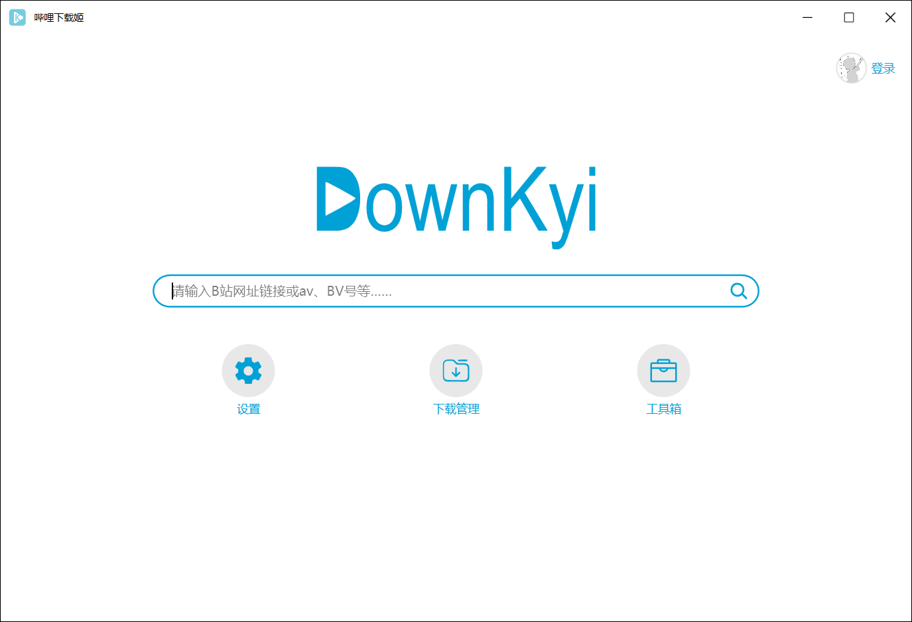

# 哔哩下载姬

## 关于

哔哩下载姬（downkyi）是一个简单易用的哔哩哔哩视频下载工具，具有简洁的界面，流畅的操作逻辑。哔哩下载姬可以下载几乎所有的B站视频，并输出mp4格式的文件；采用Aria下载器多线程下载，采用FFmpeg对视频进行混流、提取音视频等操作。

- [x] 支持二维码登录
- [x] 支持4K下载
- [x] 支持视频、番剧、剧集、电影、课程下载
- [x] **支持用户收藏夹、订阅、稍后再看、历史记录下载**
- [x] **支持港澳台番剧下载，解除地区限制**
- [x] 支持封面下载
- [x] 支持断点续传
- [x] 支持Aria2c
- [x] 支持下载历史记录保存
- [x] 支持av、BV互转
- [x] 支持弹幕发送者查询
- [x] 支持音视频分离
- [x] 支持去水印
- [x] 支持检查更新

## 使用方法

### 环境

要求 .NET Framework >= 4.7.2

- 安装 [.NET Framework 4.7.2](https://dotnet.microsoft.com/download/dotnet-framework/net472)

- [.NET Framework 4.7.2 在线安装程序](https://download.microsoft.com/download/0/5/C/05C1EC0E-D5EE-463B-BFE3-9311376A6809/NDP472-KB4054531-Web.exe)

- [.NET Framework 4.7.2 离线安装程序](https://download.microsoft.com/download/6/E/4/6E48E8AB-DC00-419E-9704-06DD46E5F81D/NDP472-KB4054530-x86-x64-AllOS-ENU.exe)

- 也可以安装 [.NET Framework 4.8](https://dotnet.microsoft.com/download/dotnet-framework/net48)

### 检索

哔哩下载姬支持多种复制于浏览器或APP的网址格式，在程序主页输入并按回车键即可开始检索。

- 检索只获取视频的基本信息，视频下载链接需点击解析。（v1.3.5）
- 监听剪贴板，复制即可开始检索。（v1.3.6）
- 视频详情页中，先选中视频再下载，如果该视频已经在下载队列或者已下载列表中，则不会被添加。
- 用户收藏夹、订阅、稍后再看、历史记录中，点击下载后，会默认下载选中视频的所有分P。

目前已支持的有：

- [x] av号：av170001，https://www.bilibili.com/video/av170001
- [x] BV号：BV17x411w7KC，https://www.bilibili.com/video/BV17x411w7KC
- [x] 番剧（电影、电视剧）ss号：https://www.bilibili.com/bangumi/play/ss32982
- [x] 番剧（电影、电视剧）ep号：https://www.bilibili.com/bangumi/play/ep317925
- [x] 番剧（电影、电视剧）md号：https://www.bilibili.com/bangumi/media/md28228367
- [x] 课程ss号：https://www.bilibili.com/cheese/play/ss205
- [x] 课程ep号：https://www.bilibili.com/cheese/play/ep3489
- [x] 用户空间：uid928123，UID:928123，https://space.bilibili.com/928123

`注：因为番剧和课程都有ss号和ep号，因此暂时不能直接输入ss号和ep号。`

## 更新日志

[全部更新日志](https://github.com/FlySelfLog/downkyi/blob/main/CHANGELOG.md)

* `2021/03/04` v1.3.6
    1. [修复] 下载FLV时失败的问题。
    2. [修复] 主页的登录信息更新不及时的问题。
    3. [优化] 主页下方按钮居中。
    4. [优化] 首页搜索框添加搜索按钮，点击可进行搜索。
    5. [新增] 监听剪贴板。
    6. [新增] 已下载视频列表排序。
    7. [新增] 下载管理页面增加全部暂停、全部开始、全部删除。

## 下载

- [哔哩下载姬最新版](https://github.com/FlySelfLog/downkyi/releases/download/v1.3.5/DownKyi-28-1.3.5.zip)

- [下载页面](https://github.com/FlySelfLog/downkyi/releases)

## 赞助

如果这个项目对您有很大帮助，并且您希望支持该项目的开发和维护，请随时扫描一下二维码进行捐赠。非常感谢您的捐款，谢谢！

## 开源计划

一开始本来只是想写个小程序自己临时用用，所以前期的代码写得相当放荡不羁，逻辑层次不清、缺少抽象，一个方法中代码上百行的情况经常出现，目前正在一点点地重构。计划第一步先把Core.dll中的代码重构完了之后开源这部分，主要包括B站API的C#实现、Aria2的C#调用实现，以及其他的公共函数。因为目前程序开发还处于前期功能更新的阶段，大量精力都投入到了开发新功能中，还有日常生活工作学习的诸多事务需要处理，重构的工作进展相对缓慢，还请对本项目感兴趣的同志耐心等待。

## 免责申明

1. 本软件只提供视频解析，不提供任何资源上传、存储到服务器的功能。
2. 本软件仅解析来自B站的内容，不会对解析到的音视频进行二次编码，部分视频会进行有限的格式转换、拼接等操作。
3. 本软件解析得到的所有内容均来自B站UP主上传、分享，其版权均归原作者所有。内容提供者、上传者（UP主）应对其提供、上传的内容承担全部责任。
4. **本软件提供的所有内容，仅可用作学习交流使用，未经原作者授权，禁止用于其他用途。请在下载24小时内删除。为尊重作者版权，请前往资源的原始发布网站观看，支持原创，谢谢。**
5. 因使用本软件产生的版权问题，软件作者概不负责。
